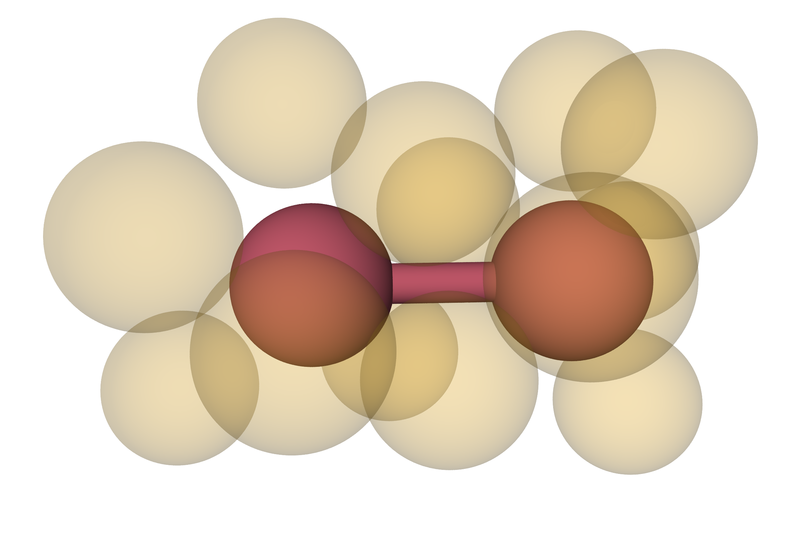

# Using Voronoi tesselations in a solvated dimer system to determine both equilibrium and kinetic properties
A C++ code implementing schemes for determining equilibrium and kinetic properties of a [solvated dimer system](https://aip.scitation.org/doi/abs/10.1063/1.478569).
To do so, run_voronoi.cpp implements a [Voronoi-based free energy method](https://doi.org/10.1002/jcc.21332) to determine equilibrium probabilities of different bond distances by looking at the equilibrium fluxes between cells, which the associated free_energy.py script will determine.
run_tilt.cpp then examines the reaction rate by using a [trajectory tilting procedure](https://aip.scitation.org/doi/full/10.1063/1.3180821) in which the equilibrium probability procedure is "tilted" to only examine trajectories that have started in the reactant state.
This example is here to demonstrate knowledge of MPI and LAPACK, which is needed in run_tilt.cpp in order to calculate the probabilities on-the-fly during sampling.
The code hasn't been thoroughly tested yet.
Both can be made by running the associated makefiles.

# Pretty images of dimers
Example of the dimer in the compact state

Example of the dimer in the extended state

