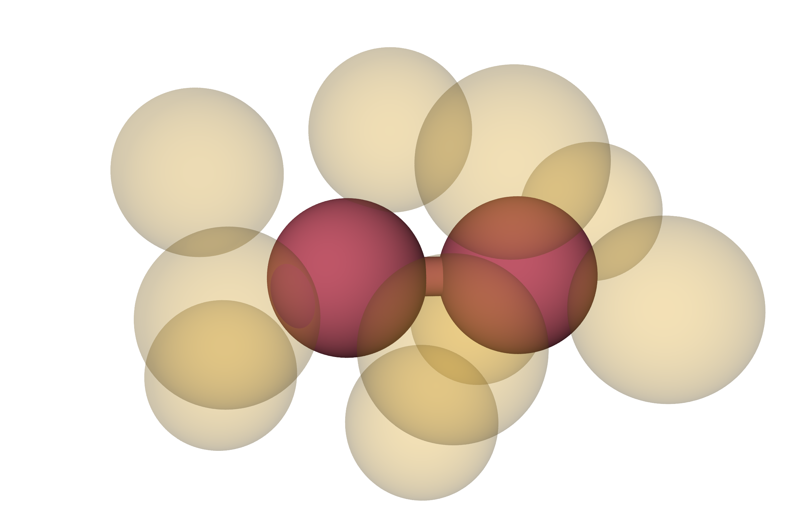

# Adventures in a solvated dimer system using voronoi tesselations to determine both equilibrium and kinetic properties
A C++ code implementing schemes for determining equilibrium and kinetic properties of a [solvated dimer system](https://aip.scitation.org/doi/abs/10.1063/1.478569).
To do so, run_voronoi.cpp implements essentially a fixed version of the [finite-temperature string method](https://aip.scitation.org/doi/full/10.1063/1.3130083) to determine equilibrium probabilities of different bond distances by looking at the equilibrium fluxes between cells.
run_tilt.cpp then examines the reaction rate by using a [trajectory tilting procedure](https://aip.scitation.org/doi/full/10.1063/1.3180821) in which the equilibrium probability procedure for the equilibrium case is "tilted" to only examine trajectories that have started in the reactant state.
This example is here to demonstrate knowledge of MPI and LAPACK, which is needed in run_tilt.cpp in order to calculate the probabilities on-the-fly.
The code hasn't been thoroughly tested yet.

# Pretty images of dimers
Example of the dimer in the compact state

Example of the dimer in the extended state

